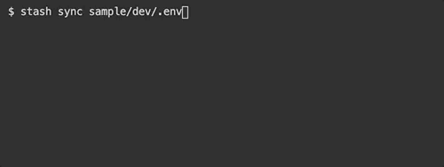
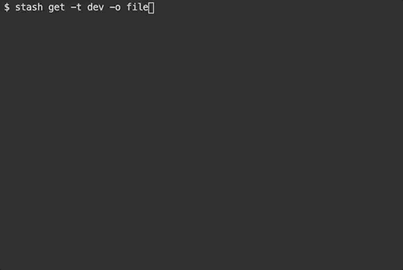
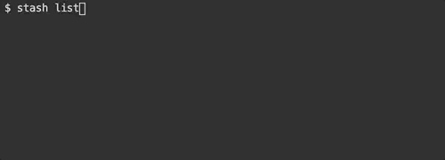

# Stash CLI and Go Integration Library

Stash provides basic CLI [commands](#commands) and a Go integration [library](#application-integration) to sync, edit, get, and purge configuration files in cloud services instead of working with individual key/value pairs, unique commands, and encryption details specific to each cloud [service](#aws-supported-services). Does using *Stash* improve [security](/SECURITY.md)?



Stashed files are replaced locally by a `stash.yml` [file](/CATALOG.md) that can be shared and checked into source control safely. `stash.yml` remembers the cloud [service](#aws-supported-services) and file encryption details making editing, restoration, or consumption a single command. There are multiple [AWS methods](/AWS_METHODS.md) that can be considered when consuming configuration.


[](https://godoc.org/github.com/dabblebox/stash)


## AWS Supported Services

When stashing configuration files, a cloud service, a.k.a. stash, must be chosen. When a service supports key/value pairs, `.env` and `.json` configuration files can be parsed, stashed individually, and restored as a single file.

|Service|File Types|Encryption|Granting Access|
|-|-|-|-|
|[AWS Secrets Manager](https://aws.amazon.com/secretsmanager/)|.env, .json, .js, .ts, .yml, .xml, .sql, .cert, id_rsa|[KMS](https://aws.amazon.com/kms/)|[Secrets](https://docs.aws.amazon.com/secretsmanager/latest/userguide/auth-and-access_identity-based-policies.html#permissions_grant-get-secret-value-to-one-secret)|
|[AWS Parameter Store](https://docs.aws.amazon.com/systems-manager/latest/userguide/systems-manager-parameter-store.html)|.env|[KMS](https://aws.amazon.com/kms/)|[Parameters](https://docs.aws.amazon.com/systems-manager/latest/userguide/sysman-paramstore-access.html)|
|[AWS S3 Storage](https://aws.amazon.com/s3/)|*|[KMS](https://aws.amazon.com/kms/)|[Files](https://aws.amazon.com/blogs/security/writing-iam-policies-how-to-grant-access-to-an-amazon-s3-bucket/)|

## Get Started

1. Install CLI

```bash
$ curl -s https://raw.githubusercontent.com/dabblebox/stash/master/install.io | sh
```

2. Manage Configuration

```bash
$ export AWS_REGION=us-east-1
$ export AWS_PROFILE=user-profile-devops

# sync configs
$ stash sync config/dev/.env

# edit configs
$ stash edit -t dev

# get configs
$ stash get -t dev

# generate Terraform
$ stash get -t dev -o terraform
```
For authentication, see [Specifying Credentials](https://docs.aws.amazon.com/sdk-for-go/v1/developer-guide/configuring-sdk.html#specifying-credentials) in the AWS SDK for Go documentation.

## Commands

<details>
  <summary>$ stash sync</summary>


Upload and sync new or modified configuration files to a cloud service.

Command:
```bash
stash sync [<file_path>|<regex>...] [flags]
```

Examples:
```bash
# file paths
$ stash sync config/dev/.env config/qa/.env

# regular expressions (escape \backslashes or 'quote' expressions)
$ stash sync .*\\.env$ .*\\.json$
```

|Flag|Short|Example|Default|Description|
|-|-|-|-|-|
|--file|-f| slickapp.yml |stash.yml|catalog path with file name|
|--context|-c| slickapp |parent folder|prefix for cloud service keys|
|--service|-s| secrets-manager, paramter-store, s3 ||cloud service|
|--tags|-t| config,dev,app|file path and name|file reference tags|

</details>

<details>
  <summary>$ stash edit</summary>


Download and open configuration inside an editor. When the file is closed after modifications, sync with the cloud service.

Optionally set preferred editor. (default: `vim`)
```bash
$ export EDITOR="code"
```

Command:
```bash
stash edit [<file_path>...] [flags]
```

Examples:
```bash
# browse
$ stash edit

# file paths
$ stash edit config/dev/.env config/qa/.env

# file tags
$ stash edit -t config,dev
```

|Flag|Short|Example|Description|
|-|-|-|-|
|--file|-f| stash.yml|catalog path with file name|
|--service|-s| secrets-manager, paramter-store, s3 |cloud service|
|--tags|-t| config,dev,app|file reference tags|

</details>

<details>
  <summary>$ stash get</summary>



Download configuration files and apply optional transformations to the config. By default, the files are sent to `stdout` allowing the config to be piped anywhere including a new file location. The files can be restored to their original folder locations using the flag, `-o file`. 

**IMPORTANT**: When restoring configuration for a service, make sure configuration is not printed anywhere or sent to logs via `stdout`.

Command:
```bash
stash get [<file_path>...] [flags]
```

Examples:
```bash
# by file paths
$ stash get config/dev/.env config/qa/.env 

# by file tags
$ stash get -t config,dev

# by cloud service
$ stash get -s s3

# restore original files
$ stash get -o file

# create new files
$ stash get >> .env

# apply data transformation
$ stash get -o json >> .env

# export environment variables
$ eval $( stash get -t dev -o terminal-export )
```

|Flag|Short|Example|Description|
|-|-|-|-|
|--file|-f| stash.yml|catalog path with file name|
|--service|-s| secrets-manager, paramter-store, s3 |cloud service|
|--tags|-t| config,dev,app|file reference tags|
|--output|-o| terminal-export|configuration output|

#### Configuration Outputs

Using the `--output` or `-o` flag, the stashed configuration can be downloaded, transformed or replaced, and sent to `stdout`. Each service supports specific outputs and file types as charted below. When the output flag is omitted, the original file data is sent to `stdout`.

||Secrets Manager|Parameter Store| S3 Storage| | |
|-|-|-|-|-|-|
|file|*|*|*|file system|original file|
|terraform|*|*|*|file system|[terraform scripts](/TERRAFORM.md)|
|ecs-task-inject-json|*|*|.env|stdout|AWS ECS task definition [secrets](https://docs.aws.amazon.com/AmazonECS/latest/developerguide/specifying-sensitive-data.html) / [envfile](https://docs.aws.amazon.com/AmazonECS/latest/developerguide/taskdef-envfiles.html) (JSON) (key/arn)|
|ecs-task-inject-env|*|*|.env|stdout|AWS ECS task definition [secrets](https://docs.aws.amazon.com/AmazonECS/latest/developerguide/specifying-sensitive-data.html) / [envfile](https://docs.aws.amazon.com/AmazonECS/latest/developerguide/taskdef-envfiles.html) (ENV) (key/arn)|
|ecs-task-env|.env|.env|.env|stdout|AWS ECS task definition [environment](https://docs.aws.amazon.com/AWSCloudFormation/latest/UserGuide/aws-properties-ecs-taskdefinition-containerdefinitions.html#cfn-ecs-taskdefinition-containerdefinition-environment) (JSON) (key/value)|
|json|.env|.env|.env|stdout|JSON object|
|terminal-export|.env|.env|.env|stdout|prepend "export " to each key/value pair|

</details>

<details>
  <summary>$ stash purge</summary>


Purge permanently deletes files stashed in a cloud service.

Command:
```bash
stash purge [<file_path>...] [flags]
```

Examples:
```bash
# by file names
$ stash purge config/dev/.env config/qa/.env 

# by file tags
$ stash purge -t config,dev

# by cloud service
$ stash purge -s s3
```

|Flag|Short|Example|Description|
|-|-|-|-|
|--file|-f| stash.yml|catalog path with file name|
|--service|-s| secrets-manager, paramter-store, s3 |cloud service|
|--tags|-t| config,dev,app|file reference tags|
|--warn|-s|false|skips warning prompts|

</details>

<details>
  <summary>$ stash clean</summary>


Clean deletes tracked local files to avoid secrets remaining on developer machines.

Command:
```bash
stash clean [<file_path>...] [flags]
```

Examples:
```bash
# by file names
$ stash clean config/dev/.env config/qa/.env 

# by file tags
$ stash clean -t config,dev

# by cloud service
$ stash clean -s s3
```

|Flag|Short|Example|Description|
|-|-|-|-|
|--file|-f| stash.yml|catalog path with file name|
|--service|-s| secrets-manager, paramter-store, s3 |cloud service|
|--tags|-t| config,dev,app|file reference tags|

</details>

<details>
  <summary>$ stash list</summary>



List displays tracked files, tags, and cloud service keys.

Command:
```bash
stash list [<file_path>...] [flags]
```

Examples:
```bash
# all
$ stash list

# by file names
$ stash list config/dev/.env config/qa/.env 

# by file tags
$ stash list -t config,dev

# by cloud service
$ stash list -s s3
```
|Flag|Short|Example|Description|
|-|-|-|-|
|--file|-f| stash.yml|catalog path with file name|
|--service|-s| secrets-manager, paramter-store, s3 |cloud service|
|--tags|-t| config,dev,app|file reference tags|

</details>

<details>
  <summary>$ stash tag</summary>


Tags identify or group stashed files in the `stash.yml` catalog allowing actions to be performed against file groups.

Command:
```bash
stash tag [<file_path>...] [flags]
```

Examples:
```bash
# overwrite tags
$ stash tag config/dev/.env config/qa/.env -t app,non-prod

# add tag
$ stash tag -a non-prod

# delete tag
$ stash tag -d config

# add tag by tags
$ stash tag -t non-prod -a config

# add tag by service
$ stash tag -s s3 -a config
```

|Flag|Short|Example|Description|
|-|-|-|-|
|--file|-f| stash.yml|catalog path with file name|
|--service|-s| secrets-manager, paramter-store, s3 |cloud service|
|--tags|-t| config,dev,app|file reference tags|
|--add|-a|app,non-prod|add tags|
|--delete|-d|app,non-prod|delete tags|

</details>

<details>
  <summary>$ stash inject</summary>

After updating Secrets Manager or Parameter Store through `$ stash sync` or manually in the AWS Console, the stashed values can be injected into a configuration file locally or in a running container.

Add tokens to any configuration file using `${SECRET_NAME::SECRET_KEY}` for Secrets Manager or `${PARAM_PATH::PARAM_NAME}` for Parameter Store.

Example `config.json`
```json
{
  "db_user": "${app/dev/db::user}",
  "db_password": "${app/dev/db::password}",
}
```

Inject secrets from the specified stash, `-s secrets-manager`, into the configuration file, `config.json`. The `inject` command does not require a `stash.yml` catalog file.

Command:
```bash
stash inject [<file_path>...] [flags]
```

Examples:
```bash
$ stash inject config.json -s secrets-manager
```

|Flag|Short|Example|Description|
|-|-|-|-|
|--service|-s| secrets-manager, paramter-store, s3 |cloud service|
|--output|-o| terminal-export|file output format|

</details>

## Environment Variables

<details>
  <summary>Override Catalog Fields</summary>

Any field in `stash.yml` can be overridden when exported before using `$ stash get`. (use "`_`" to access children)

S3 Bucket Example
```yaml
files:
  sample_dev__env:
    path: sample/dev/.env
    type: env
    stash: s3
    opt:
      s3_bucket: configs
```
```bash
$ export STASH_FILES_SAMPLE_DEV__ENV_OPT_S3_BUCKET=new-configs
```

</details>

<details>
  <summary>Template Catalog Files</summary>

Additional template files can be added to the catalog to allow environment variable expansion when getting configuration for an application. This is useful when the `stash.yml` file cannot be aware of all application environments during the artifact/image build step.

```bash
$ export ENV=dev
$ export VERSION=v1.0.0
```

```yaml
files:
  template:
    path: sample/${VERSION}/${ENV}/.env
    type: env
    stash: s3
    tags:
    - config
```

```bash
$ stash get -t config
```

</details>

<details>
  <summary>Set Defaults / Override Prompts</summary>

When syncing files, setting environment variables will override prompts.

|Variable|default|Description|
|-|-|-|
|`STASH_CATALOG`| `stash.yml` |name of the catalog file|
|`STASH_CONTEXT`| working directory |prefix for cloud keys|
|`STASH_KMS_KEY_ID`| Default Account Key |KMS Key ID or Default Account Key|
|`STASH_S3_BUCKET`| |S3 bucket name|
|`STASH_SERVICE`| prompt user |cloud service|
|`STASH_WARN`| `true` |confirm purge|

</details>

## Application Integration

<details>
  <summary>Get Config</summary>

```go
package main

import (
	"log"

	"github.com/dabblebox/stash"
	"github.com/dabblebox/stash/component/output"
)

config, err := stash.GetMap(stash.GetOptions{})
if err != nil {
  log.Fatal(err)
}

for k, v := range config {
  log.Printf("%s=%s\n", k, v)
}
```

</details>

<details>
  <summary>Inject Config</summary>

```go
package main

import (
	"log"

	"github.com/dabblebox/stash"
	"github.com/dabblebox/stash/component/output"
)

files, err := stash.Inject(stash.InjectOptions{
  Files: []string{"config.json"}
})
if err != nil {
  log.Fatal(err)
}

for _, f := range files {
  log.Printf("%s\n", string(f.Data))
}
```
</details>
